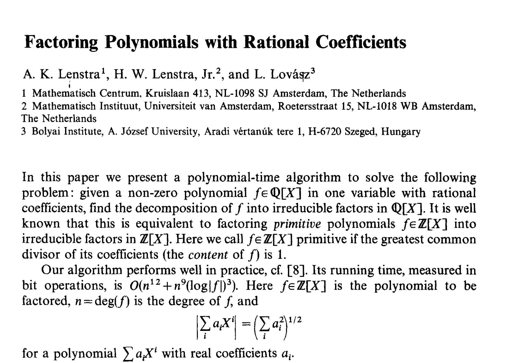

# LLL-Reduction-from-Factoring-Polynomials-with-Rational-Coefficients
Coding the 1982 paper that introduced the LLL algorithm: "Factoring Polynomials with Rational Coefficients" by Lenstra, Lenstra and Lovasz. Complete writeup available on [LeetArxiv](https://leetarxiv.substack.com/p/lll-algorithm-for-computer-scientists).


The _1982 paper, Factoring Polynomials with Rational Coefficients_ (Lenstra, Lenstra & Lovasz, 1982) introduced LLL, an algorithm for finding short vectors in a lattice in polynomial time.
We code the LLL algorithm in Python to understand it's inner workings.

You might also enjoy:
1. [Gauss-Lagrange 2D Lattice Reduction](https://leetarxiv.substack.com/p/2-dimensional-lattice-basis-reduction).
2. [Gauss Lattice Sieving](https://leetarxiv.substack.com/p/gauss-lll-sieve)

## Getting Started

Run the code using:
```
jupyter notebook
```

